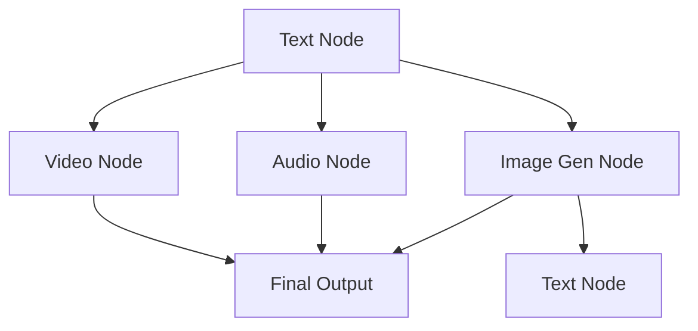

## 1. Product Overview

The Ultimate AI Workflow Studio is a node-based visual editor for creating AI-powered content workflows. It combines the flexibility of ComfyUI with the intuitive design of Figma, enabling creators to build complex AI content pipelines through an intuitive drag-and-drop interface.

This tool solves the problem of complex AI tool chaining by providing a visual, node-based interface where users can connect different AI models (text, image, video, audio) to create sophisticated content generation workflows without coding knowledge.

## 2. Core Features

### 2.1 User Roles
| Role | Registration Method | Core Permissions |
|------|---------------------|------------------|
| Creator | Email registration | Create, edit, and save workflows; use all node types |
| Viewer | Guest access | View shared workflows; cannot edit or create |

### 2.2 Feature Module

The AI Workflow Studio consists of the following main interface:

1. **Main Canvas**: Full-screen workspace with node-based editor, left sidebar drawer system, top header controls, and bottom toolbar.
2. **Workflow Modal**: Template selection dialog triggered by sidebar add button.
3. **Context Menu**: Double-click menu for adding new nodes to canvas.

### 2.3 Page Details

| Page Name | Module Name | Feature description |
|-----------|-------------|---------------------|
| Main Canvas | App Shell | Full-screen layout with deep dark background (#000000) and subtle dot pattern. |
| Main Canvas | Left Sidebar | Fixed 64px width with 6 icons (Add, Assets, Workflow, History, Tools, User Avatar). Clicking slides out glassmorphism panels (320px width). |
| Main Canvas | Sidebar Panels | Assets panel shows grid of media assets. Workflow panel shows list of saved workflows. History panel shows time-grouped grid of recent actions. |
| Main Canvas | Top Header | Project title input field, "Get Tapies" badge, Share button with collaboration features. |
| Main Canvas | Bottom Controls | Left: MiniMap toggle, Grid toggle, Fit View button, Zoom slider. Right: Floating AI Chat button. |
| Main Canvas | Node System | Custom React Flow nodes with dark glass aesthetic (bg-zinc-900/90, border-white/10, rounded-xl). |
| Text Node | AI Mode | Bottom floating panel with prompt input, Gemini model selector, settings gear icon. |
| Text Node | Edit Mode | Double-click activates Tiptap rich text editor with top toolbar (H1, Bold, Italic, List). |
| Text Node | Smart Logic | Auto-detects connections to Image nodes and shows thumbnail with "Generate prompt from image" button. |
| Video Node | Preview Area | 16:9 aspect ratio video preview with placeholder content. |
| Video Node | Settings Panel | Floating bottom bar with model selector (Kling/Wan 2.6), aspect ratio popover, resolution dropdown, duration selector. |
| Audio Node | Player Controls | Play/Pause button, timecode display, CSS animated cyan waveform bars. |
| Audio Node | Settings | Instrumental toggle switch, duration dropdown (30s, 1m). |
| Image Gen Node | Display Area | Image preview with focus mode that dims rest of canvas when active. |
| Image Gen Node | Top Toolbar | Appears above node when selected with Redraw, Erase, Enhance, Expand, Inpaint icons. |
| Image Gen Node | Bottom Settings | Model selector with time estimate badge, Style button with magic wand, Camera Control switch, Resolution dropdown. |
| Image Gen Node | Camera Control Popover | Three horizontal carousels for Film types, Lens options, Aperture settings with visual icons. |
| Image Gen Node | Resolution Popover | Tabbed interface (1K, 2K, 4K) with visual aspect ratio grid boxes. |
| Workflow Modal | Template Categories | Left navigation with category list, right grid of template cards with preview thumbnails. |
| Context Menu | Add Nodes | Double-click opens menu at cursor position with Text, Image, Video, Audio, Upload options. |
| Edge System | Connections | Animated SVG edges connecting nodes with data flow logic. |

## 3. Core Process

### Creator Workflow
1. User opens the application and sees the main canvas with sidebar and controls
2. User clicks the "+" icon in sidebar to open Workflow Modal
3. User selects a template category and chooses a template card
4. Template loads on canvas with pre-configured nodes
5. User double-clicks canvas to open Context Menu and add new nodes
6. User connects nodes by dragging between connection points
7. User configures individual nodes through their floating panels and toolbars
8. User saves workflow through header controls

### Node Connection Flow

## 4. User Interface Design

### 4.1 Design Style
- **Primary Color**: Deep dark background (#000000)
- **Secondary Colors**: Zinc-900/90 with white/10 borders
- **Button Style**: Rounded-xl with glassmorphism effect
- **Font**: System fonts with consistent sizing hierarchy
- **Layout Style**: Full-screen canvas with overlay panels
- **Icon Style**: Lucide React icons with consistent stroke width

### 4.2 Page Design Overview

| Page Name | Module Name | UI Elements |
|-----------|-------------|-------------|
| Main Canvas | Background | Pure black (#000000) with subtle dot pattern overlay using CSS radial gradients. |
| Main Canvas | Glass Panels | Backdrop-blur-md with bg-zinc-900/90 and border-white/10, rounded-xl corners. |
| Text Node | Container | Dark glass aesthetic with floating panels that appear above node on hover/selection. |
| Video Node | Preview | 16:9 aspect ratio container with centered play icon and gradient overlay. |
| Audio Node | Waveform | CSS animated bars in cyan color with smooth transitions and playhead indicator. |
| Image Gen Node | Toolbar | Horizontal icon bar appearing above selected node with tooltips on hover. |
| Camera Control | Carousels | Horizontal scrollable rows with visual cards for film, lens, and aperture options. |

### 4.3 Responsiveness
Desktop-first design approach with touch interaction optimization for tablet use. Canvas and node system designed for precise mouse/trackpad interaction with keyboard shortcuts support.

### 4.4 3D Scene Guidance
Not applicable for this 2D node-based interface.