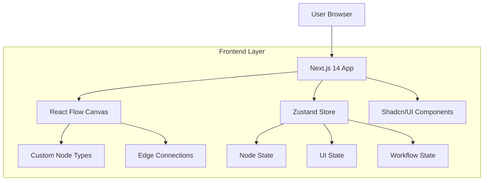

## 1. Architecture Design



## 2. Technology Description

- **Frontend**: Next.js 14 (App Router) + React 18 + TypeScript
- **Styling**: Tailwind CSS 3 with deep dark mode (#000000)
- **Canvas Engine**: @xyflow/react (React Flow)
- **UI Components**: Shadcn/UI (Dialog, Popover, Slider, Switch, ScrollArea, Tabs, ToggleGroup)
- **Icons**: Lucide React
- **State Management**: Zustand
- **Rich Text Editor**: Tiptap (for Text Node editing)
- **Animation**: Framer Motion
- **Initialization Tool**: create-next-app

## 3. Route Definitions

| Route | Purpose |
|-------|---------|
| / | Main canvas workspace with node editor |
| /workflows | Saved workflows management (accessible via sidebar) |
| /assets | Asset library management (accessible via sidebar) |
| /history | Workflow history and versions (accessible via sidebar) |

## 4. Component Structure

### 4.1 Core Components

```
src/
├── app/
│   ├── layout.tsx          # Root layout with providers
│   ├── page.tsx            # Main canvas page
│   └── globals.css         # Tailwind and custom styles
├── components/
│   ├── canvas/
│   │   ├── Canvas.tsx      # Main React Flow canvas
│   │   ├── CanvasControls.tsx  # Bottom control bar
│   │   └── CanvasContextMenu.tsx # Right-click menu
│   ├── layout/
│   │   ├── AppShell.tsx    # Full-screen layout wrapper
│   │   ├── Header.tsx      # Top header with project title
│   │   ├── Sidebar.tsx     # Left sidebar drawer system
│   │   └── SidebarPanel.tsx # Sliding glass panels
│   ├── nodes/
│   │   ├── TextNode.tsx    # Text generation node
│   │   ├── VideoNode.tsx   # Video generation node
│   │   ├── AudioNode.tsx   # Audio generation node
│   │   ├── ImageGenNode.tsx # Image generation node
│   │   └── node-types.ts   # Node type definitions
│   ├── ui/
│   │   └── # Shadcn/UI components
│   └── modals/
│       ├── WorkflowModal.tsx # Template selection dialog
│       └── SettingsModal.tsx # Global settings
├── stores/
│   ├── useCanvasStore.ts   # Canvas and node state
│   ├── useUIStore.ts      # UI state (panels, modals)
│   └── useWorkflowStore.ts # Workflow persistence
├── hooks/
│   ├── useNodeConnections.ts # Connection logic
│   ├── useCanvasEvents.ts   # Canvas event handlers
│   └── useKeyboardShortcuts.ts # Keyboard shortcuts
└── lib/
    ├── node-utils.ts       # Node creation utilities
    └── constants.ts        # App constants and configs
```

### 4.2 Node Architecture

Each custom node follows this structure:
- **Node Container**: Dark glass aesthetic wrapper
- **Header**: Node title and type indicator
- **Body**: Main content area (preview, editor, etc.)
- **Floating Panels**: Contextual controls that appear on interaction
- **Connection Handles**: Input/output points for edges

## 5. State Management (Zustand)

### 5.1 Canvas Store
```typescript
interface CanvasState {
  nodes: Node[];
  edges: Edge[];
  selectedNodes: string[];
  viewport: Viewport;
  showMinimap: boolean;
  showGrid: boolean;
  zoomLevel: number;
  
  // Actions
  addNode: (type: NodeType, position: XYPosition) => void;
  updateNode: (id: string, data: any) => void;
  deleteNode: (id: string) => void;
  connectNodes: (source: string, target: string) => void;
  setViewport: (viewport: Viewport) => void;
  toggleMinimap: () => void;
  toggleGrid: () => void;
  setZoom: (level: number) => void;
}
```

### 5.2 UI Store
```typescript
interface UIState {
  activePanel: PanelType | null;
  modalOpen: ModalType | null;
  contextMenu: ContextMenuState | null;
  theme: 'dark';
  
  // Actions
  setActivePanel: (panel: PanelType | null) => void;
  openModal: (modal: ModalType) => void;
  closeModal: () => void;
  showContextMenu: (event: MouseEvent, options: MenuOption[]) => void;
  hideContextMenu: () => void;
}
```

### 5.3 Workflow Store
```typescript
interface WorkflowState {
  currentWorkflow: Workflow | null;
  workflows: Workflow[];
  history: WorkflowHistory[];
  
  // Actions
  saveWorkflow: (workflow: Workflow) => void;
  loadWorkflow: (id: string) => void;
  deleteWorkflow: (id: string) => void;
  addToHistory: (action: HistoryAction) => void;
  undo: () => void;
  redo: () => void;
}
```

## 6. Styling Strategy

### 6.1 Tailwind Configuration
```javascript
// tailwind.config.js
module.exports = {
  darkMode: 'class',
  theme: {
    extend: {
      colors: {
        background: '#000000',
        foreground: '#ffffff',
        card: {
          DEFAULT: 'rgba(24, 24, 27, 0.9)', // zinc-900/90
          foreground: '#ffffff',
        },
        border: 'rgba(255, 255, 255, 0.1)', // white/10
        accent: {
          cyan: '#06b6d4',
          purple: '#a855f7',
        }
      },
      backdropBlur: {
        xs: '2px',
        sm: '4px',
        md: '8px',
      },
      animation: {
        'fade-in': 'fadeIn 0.2s ease-in-out',
        'slide-out': 'slideOut 0.3s ease-out',
        'waveform': 'waveform 1s ease-in-out infinite',
      }
    }
  }
}
```

### 6.2 Glassmorphism Panels
```css
.glass-panel {
  @apply bg-card/90 backdrop-blur-md border border-border rounded-xl shadow-2xl;
}

.glass-panel-hover {
  @apply hover:bg-card/95 transition-all duration-200;
}
```

### 6.3 Node Styling
```css
.node-container {
  @apply bg-zinc-900/90 border border-white/10 rounded-xl shadow-lg;
  @apply backdrop-blur-sm transition-all duration-200;
}

.node-container:hover {
  @apply border-white/20 shadow-xl;
}

.node-selected {
  @apply border-cyan-400/50 shadow-cyan-400/20;
}
```

## 7. Node Type Definitions

```typescript
// types/node.types.ts
export interface TextNodeData {
  content: string;
  mode: 'ai' | 'edit';
  prompt?: string;
  model?: 'gemini-pro' | 'gemini-ultra';
  connectedImage?: string; // Node ID of connected image
}

export interface VideoNodeData {
  prompt: string;
  model: 'kling' | 'wan-2.6';
  aspectRatio: '16:9' | '21:9' | '9:16' | '1:1';
  resolution: '1080p' | '4k';
  duration: 5 | 10 | 15 | 30;
  previewUrl?: string;
}

export interface AudioNodeData {
  prompt: string;
  duration: 30 | 60 | 120 | 180;
  instrumental: boolean;
  waveformData: number[];
  isPlaying: boolean;
  currentTime: number;
}

export interface ImageGenNodeData {
  prompt: string;
  model: 'banana-pro' | 'mj-v7' | 'sd-xl';
  style: string;
  cameraControl: {
    film: string;
    lens: string;
    aperture: string;
  };
  resolution: '1k' | '2k' | '4k';
  aspectRatio: '1:1' | '16:9' | '9:16' | '21:9';
  imageUrl?: string;
  isFocusMode: boolean;
}
```

## 8. Event System

### 8.1 Canvas Events
- **Node Double Click**: Switch Text Node to edit mode
- **Canvas Double Click**: Open context menu at cursor position
- **Node Connection**: Validate connection compatibility and update data flow
- **Node Selection**: Show/hide contextual toolbars and panels
- **Viewport Change**: Update minimap and persist viewport state

### 8.2 Keyboard Shortcuts
- **Ctrl/Cmd + S**: Save current workflow
- **Ctrl/Cmd + Z**: Undo last action
- **Ctrl/Cmd + Y**: Redo action
- **Delete/Backspace**: Delete selected nodes
- **Space**: Hold to pan canvas
- **+/-**: Zoom in/out
- **0**: Reset zoom to 100%