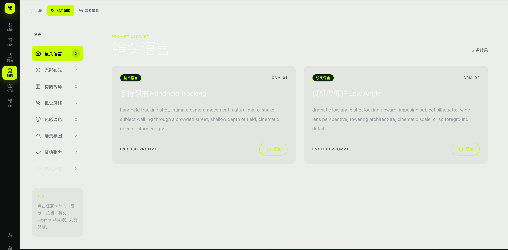
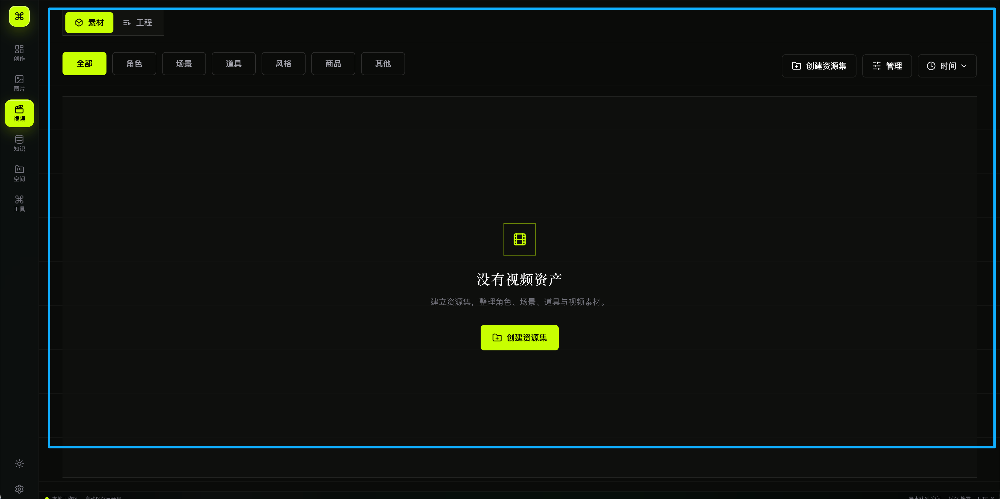
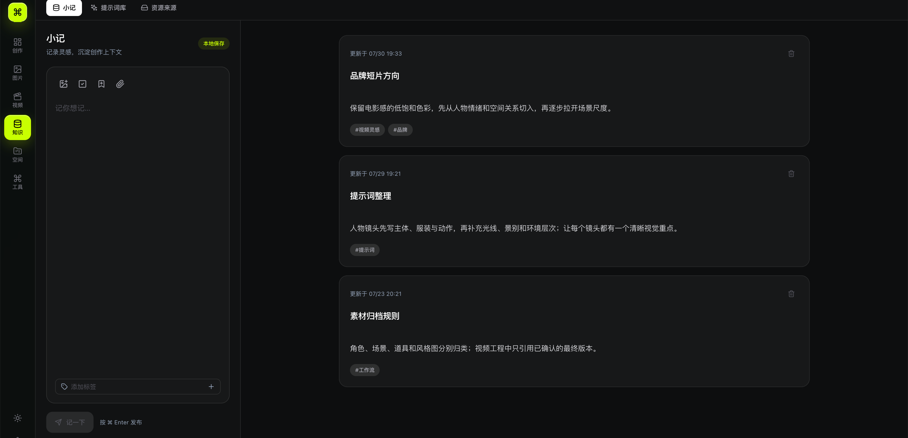
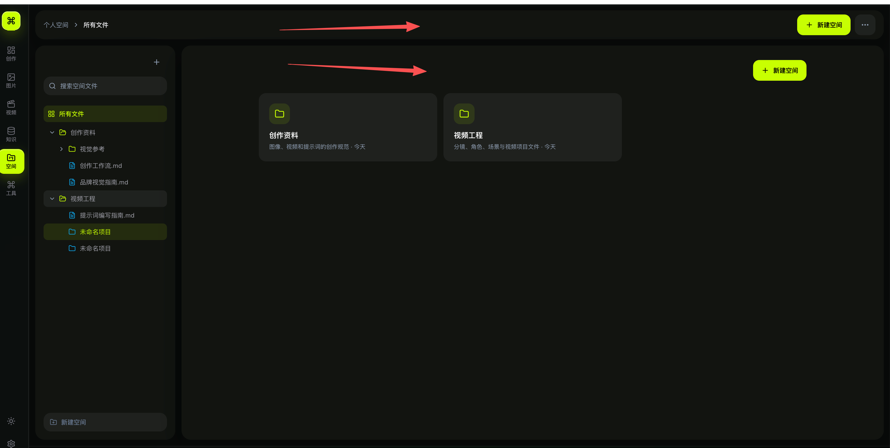

# Mboard 全页面主题与完整性走查

日期：2026-07-30  
范围：桌面暗色、桌面亮色、390 × 844 窄屏、主导航页面、知识子页、视频子页、PPT 页面、设置四个子页。

## 结论

产品尚未完成主题与响应式验收。暗色桌面主流程已经接近可用；亮色模式、窄屏侧栏页面、视频工程媒体与部分交互状态仍未达到上线标准。

建议完成度：

| 维度 | 完成度 | 结论 |
| --- | ---: | --- |
| 暗色桌面 | 80% | 主流程可用，视频工程、画布告警和细节一致性仍需处理 |
| 亮色桌面 | 55% | 设置和 PPT 主区较完整，提示词库、视频与创作模块未完成 |
| 主题色 | 60% | `#c8ff00` 已形成识别，但亮色文字对比和无效类名问题明显 |
| 圆角体系 | 50% | 存在 6–28px 多套半径，没有按组件语义收敛 |
| 窄屏响应式 | 40% | 创作输入区可用；设置、提示词库、空间结构性失效 |
| 页面完整性 | 65% | 构建通过，但存在破图、标题错配、画布容器告警和冗余入口 |

## 证据截图

### 1. 亮色提示词库：严重对比度问题

标题与卡片标题仍使用暗色页面的白色文字，亮色背景下接近不可见；荧光绿描边按钮在浅色背景上也缺少足够对比。

### 2. 暗色视频素材：视觉方向基本成立

层级、主题色和空状态较统一，是当前暗色模块里较成熟的一页；仍需补齐亮色版本，并收敛顶部按钮和主操作的圆角差异。

### 3. 暗色小记：主流程清晰

输入区与记录列表的左右结构清晰，但内容卡片、输入面板和页面外层仍有多层背景叠加，且亮色模式的绿色状态文字对比偏低。

### 4. 暗色空间：功能完整但入口重复

空间页同时出现顶部、侧栏和内容区多个“新建空间”入口，增加噪音；窄屏时固定宽侧栏会把主内容挤出视口。

## 逐步走查

1. **创作 / 图像生成 — 部分健康**
   - 暗色布局和底部输入区可用。
   - 亮色模式仍表现为暗色工作区，没有形成完整亮色对应状态。
   - 390px 宽度下输入区可用，但模型、规格和生成按钮拥挤。

2. **创作 / 视频生成 — 部分健康**
   - 暗色与窄屏主流程可用。
   - 右侧制作控制器曾显示“图片生成”，和当前视频模式不一致。
   - 亮色模式仍是暗色工作区。

3. **无限画布 — 有风险**
   - 画布本身支持黑白背景切换。
   - 控制台出现 React Flow 父容器缺少有效宽高的告警，部分尺寸下可能不渲染。
   - 亮色画布与深色制作控制器并置，主题被拆成两套。

4. **图片资产库 — 基本健康**
   - 暗色瀑布流与筛选结构成立。
   - 亮色资产卡片边界和“预览不可用”状态过淡。
   - 390px 下筛选面板打开后，图片流只剩很窄的可见区域；顶部搜索和导入按钮也发生截断。

5. **视频 / 素材 — 暗色健康、亮色未完成**
   - 暗色空状态、分类、管理与排序较完整。
   - 页面根节点和大量文字、背景使用硬编码暗色，亮色切换无效。
   - 390px 下分类仅显示部分项目，需要明确的横向滚动提示或折叠菜单。

6. **视频 / 工程 — 不健康**
   - 项目封面和详情侧栏素材出现破图。
   - 亮色模式未适配。
   - 工程信息架构存在，但媒体失败态没有降级缩略图或错误说明。

7. **知识 / 小记 — 基本健康**
   - 暗色层级清楚，输入和列表语义明确。
   - 亮色模式下状态标签、时间和次级图标对比偏低。

8. **知识 / 提示词库 — 严重不健康**
   - 亮色标题、卡片标题和按钮对比不足，核心内容难以阅读。
   - 固定 232px 分类侧栏在 390px 下把内容区压成窄条。
   - 暗色版本视觉成立，但颜色写死导致无法复用到亮色。

9. **知识 / 资源来源 — 部分健康**
   - 桌面结构和暗色模式可用。
   - 亮色状态文案继续直接使用荧光绿，在浅色背景上对比不足。

10. **空间 — 部分健康**
    - 暗色文件树和内容卡片可用。
    - 亮色模块边界过弱，荧光绿图标与文字在浅色面上不稳定。
    - 固定 270px 文件树在窄屏下遮蔽主内容。
    - “新建空间”入口重复。

11. **工具中心 — 部分健康**
    - 暗色可读，功能入口完整。
    - 28px Hero、20px 工具卡和其他模块的 12–16px 半径差异明显。
    - 亮色页面中保留完整深色 Hero 岛，和用户希望的通透、统一页面语言不一致。

12. **PPT 生成 — 基本健康**
    - 主编辑区在黑白模式下均可阅读。
    - 亮色模式右侧制作控制器仍保持深色，形成割裂的混合主题。

13. **设置 / 通用、存储、API、模型 — 桌面健康、窄屏失效**
    - 两套桌面主题较完整，表单和选择状态清楚。
    - 固定 260px 设置导航在 390px 下占据大部分弹窗，右侧内容和底部操作不可用。
    - API 编辑内容较长时接近固定底栏，需要确认滚动和底部安全距离。

## 最高优先级改动

| Before | After | Why |
| --- | --- | --- |
| 提示词库根节点固定 `text-white`，卡片标题固定浅色 | 使用语义文本 token：主文字、次级文字、反色文字分别映射亮暗主题 | 这是当前最明显的亮色阻断问题 |
| 视频素材与工程页面整体硬编码暗色 | 将页面外壳、卡片、文字、控件全部接入统一主题 token | 用户切换亮色后页面才真正切换 |
| `#c8ff00` 直接作为亮色小字和描边 | 亮色用深橄榄文本，荧光绿只做填充、强调和焦点环 | 保留品牌识别，同时满足可读性 |
| 设置、提示词库、空间使用固定宽侧栏 | 窄屏改为顶部切换、抽屉或可折叠侧栏 | 防止主内容被侧栏挤出视口 |
| 圆角从 6px 到 28px 混用 | 收敛为 8px 控件、12px 卡片、16px 大面板、24px 弹窗 | 建立稳定的组件手感和视觉秩序 |
| 约 20 处 `[#c8ff00]0` 无效 Tailwind 类名 | 修复为有效颜色与透明度类，并加入静态扫描 | 当前 hover、focus、选中状态存在静默失效风险 |
| 视频工程直接展示破图 | 增加资源校验、占位缩略图、错误状态和重试入口 | 保证内容失败时页面仍完整 |
| React Flow 容器尺寸告警 | 确保画布所有父级具有可计算的宽高，并补断点测试 | 避免画布在部分布局中空白 |
| 空间页多个“新建空间”入口 | 保留一个主入口和一个紧凑侧栏入口 | 降低重复噪音和选择成本 |
| 亮色主区与深色制作控制器并置 | 制作控制器同步主题，或明确为固定黑豹面板并统一所有页面 | 避免同一屏出现两套视觉系统 |

## 可访问性风险

- 亮色提示词库存在明显的文字/背景对比风险。
- 荧光绿直接用于浅色背景小字、细描边和状态标签，可能无法满足正文与非文本对比要求。
- 固定侧栏造成 390px 下内容不可达，属于响应式重排和缩放韧性问题。
- 部分按钮只有图标，当前多数有可访问名称，但仍需做完整键盘顺序和焦点可见性测试。
- 本轮未使用屏幕阅读器，也未完成 200% 缩放、Windows 高对比模式和减弱动效测试，不能据此声明 WCAG 合规。

## 技术验证

- `npm run typecheck`：通过。
- `npm run build`：通过。
- 构建提示主包约 691KB，后续可按页面拆分。
- 控制台存在 React Flow 容器宽高告警。
- 源码扫描发现约 20 处无效主题色类名。

## 验收建议

修复顺序应为：亮色可读性与硬编码主题 → 窄屏侧栏结构 → 破图与画布告警 → 主题色对比 → 圆角与背景层级收敛。完成后再做一次桌面双主题与 390px / 768px / 1440px 的截图回归。
